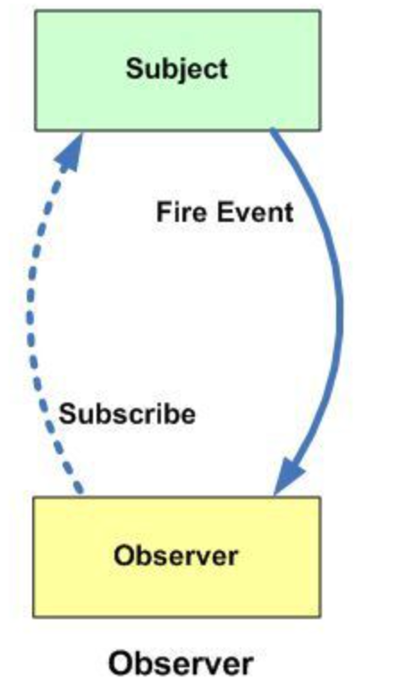

## Simple implementation of Observer Pattern with Java

We use as an example the concept of a Course with several associated students who are notified whenever new work is added to the course.

For differences between Publisher-Subscriber and Observer Pattern please read [this article](https://springbootdev.com/2017/05/17/publisher-subscriber-pattern/).